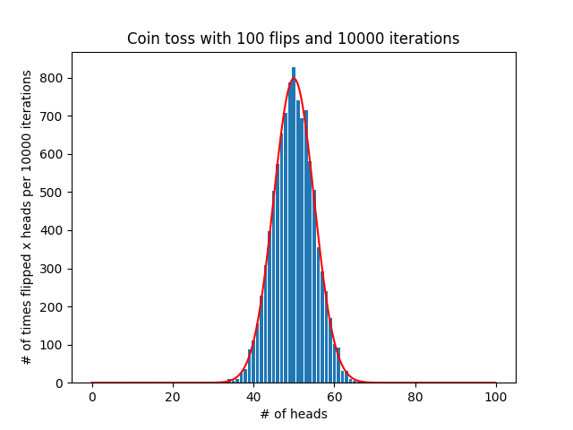

# clt-demo-cointoss

Demonstration of central limit theorem using simulated coin tosses.
The script plots a bar plot and the corresponding normal distribution.

# Dependencies

It is recommended to use virtualenv. Create a new environment:

```
virtualenv --no-site-packages -p python3 env_name
```

Activate it:

```
source env_name/bin/activate
```

Install dependencies:

```
pip install -r requirements.txt
```

# Running

Run the simulation and plot results with 100 flips and 10,000 iterations:

```
python coin_toss.py -f 100 -i 10000
```

The default values are 100 flips and 1,000 iterations.

The above example should show a plot similar to figure below, including
the coin toss results and the corresponding normal distribution.


